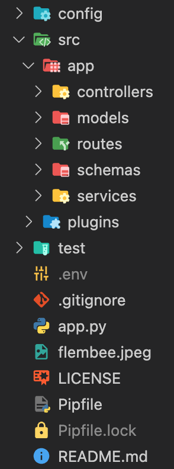

<h4 align="center">Flask Python API</h4>

<p align="center">
    <a href="https://github.com/flembee/flask-python-api/tree/main">
    
    <a href="https://github.com/flembee/flask-python-api/tree/develop">
    
</p>
      
<p align="center">
  <a href="#about">About</a> •
  <a href="#dependencies">Dependencies</a> •
  <a href="#structure">Project Structure</a> •
  <a href="#installation">Installation</a> •
  <a href="#tests">Tests</a> •
  <a href="#features">Features</a> •
  <a href="#author">Author</a> •
  <a href="#support">Support</a> •
  <a href="#contribute">Contribute</a> •
  <a href="#license">License</a>
</p>

---

## About

<table>
<tr>
<td>
  
This project is a small server using Python and Flask. It aims to show all the Flask basics, best practices and recommendations. In addition, the Flask MySQL connection is complemented, with SQLAlchemy ( **[More info Here](https://www.sqlalchemy.org/)**).

The user logins via Auth and the application is also protected by a rate limiter and during development it exposes a Swagger UI with every endpoint. Read the next section to understand how the project works and how it is recommended to be explored.

</td>
</tr>
</table>

## Dependencies

- [flask](https://palletsprojects.com/p/flask/): Python server of choise
- [flasgger](https://github.com/flasgger/flasgger): Used to generate the swagger documentation
- [flask-marshmallow](https://flask-marshmallow.readthedocs.io/en/latest/): Serializer package
- [apispec](https://apispec.readthedocs.io/en/latest/): Required for the integration between marshmallow and flasgger

## Project Structure

#### Prerequisites:

1. Python 3.x
2. MySQL database
3. docker & docker-compose

<table>
<tr>
<td>
  
The project follows a well established pattern within the Python community since it has two top level folders: `app` and `plugins`.

<p style="text-align:center">
  
</p>

The first one contains all the code that should be shared across your entire aplication, such as controllers, services, models and routes, while the second one contains all the plugins, such as the redirect code and the auth APIs (Authentication) and Database connection.

We recommend you follow this pattern, however you can generate a project with the Flembee structure or by using [Best Practices](https://auth0.com/blog/best-practices-for-flask-api-development/).

</td>
</tr>
</table>

## Installation

##### Downloading and installing steps:
* **[Download or Clone](https://github.com/flembee/flask-python-api.git)** the latest version of the Code.

1. Create an `.env` file from the template:

```console
SQL_DB = DATABASE_NAME
```

2. Install requirements:

```console
$ cd flask-python-api
$ pipenv install
$ pipenv run python -m flask run
```

Now you can run the project locally.

 **Magic!!** it will automatically start the local server. 
 > *Default port is 5000*

3. Visit http://localhost/api for the home api

4. Visit http://localhost/apidocs for the swagger documentation

5. Run flask migration to create table

```console
flask db init
flask db migrate
flask db upgrade
```
or run the db/init-scripts/ddl.sql to create table

### Docker compose Running

```console
docker-compose up --build
```
## Tests

For testing you should run the following:

```console
pipenv run python -m unittest
```

## Features

| All the features|
| :------------- | 
| Login with authorization|
| REST API|
| SQL support |
| HTTP Requests|
| Swagger|

## Author

| [](https://www.flembee.com) 	|
|:---------------------------------------------------------------------------------------------------------:	|
|                                            **Flembee**                                            	|

## Support

Contact us at one of the following ways:

- Website at https://www.flembee.com
- Github at **[flembee](https://github.com/flembee)**
- E-Mail: **flembee.technologies@gmail.com**

## Contribute

Feel free to send pull request with new features, bug fix or documentation improvements!

## License

[](https://github.com/flembee/basic-form/blob/main/LICENSE)

- Copyright © [Flembee](https://www.flembee.com).
